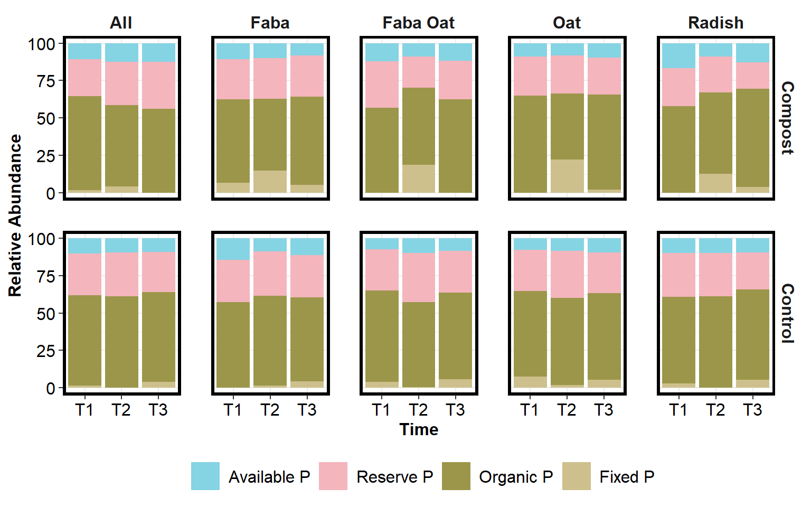
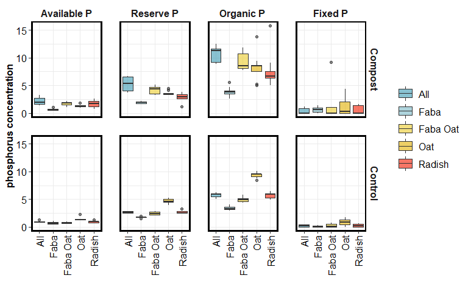
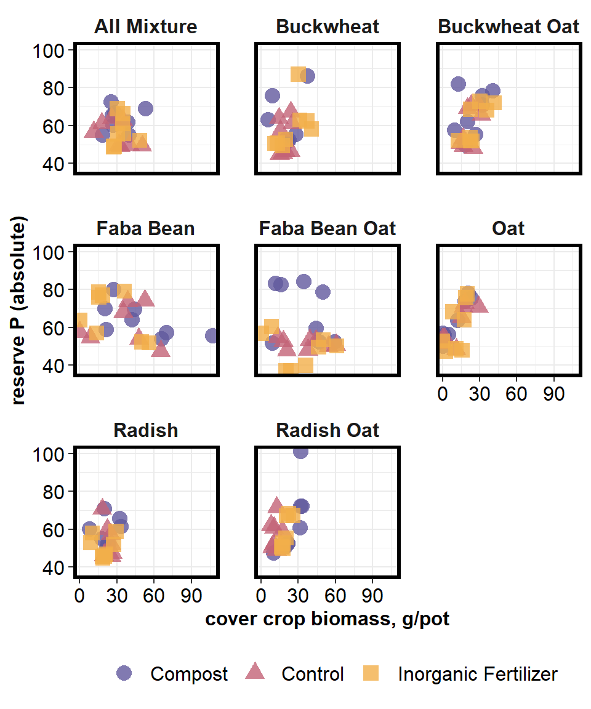
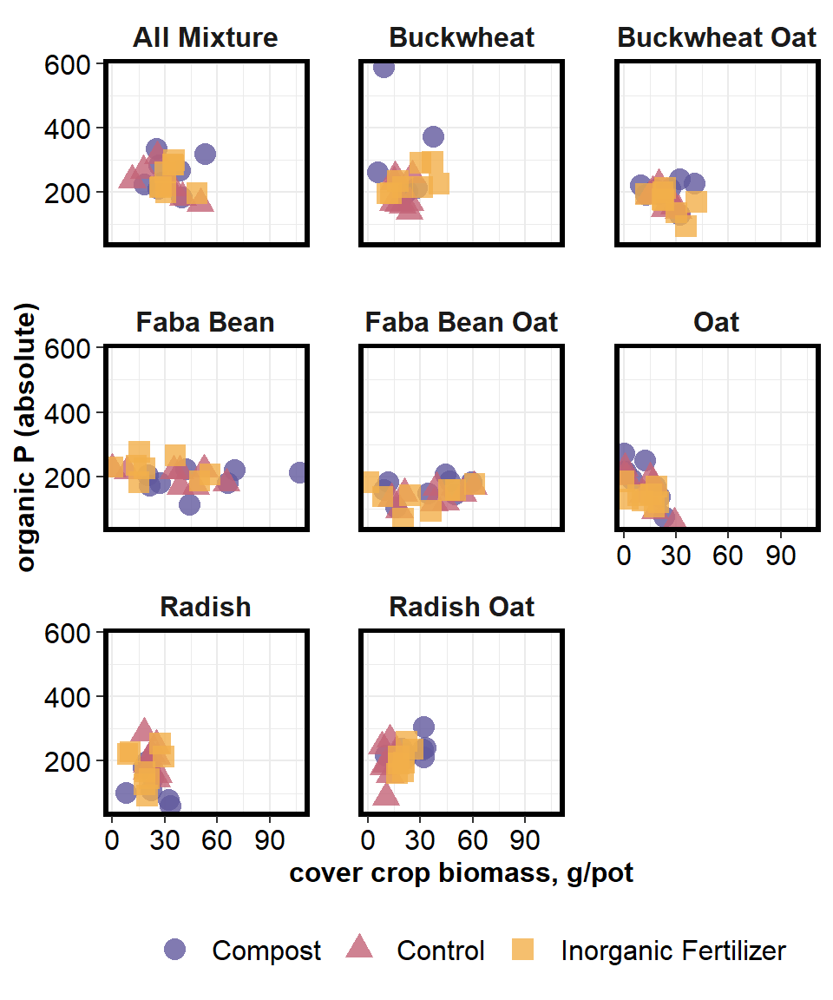
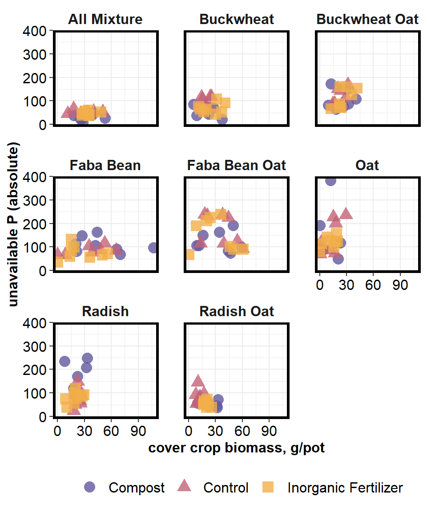
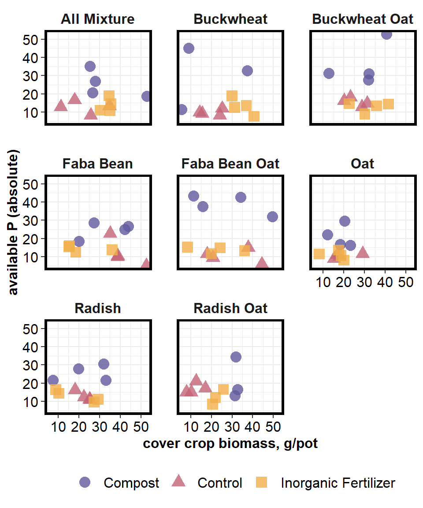
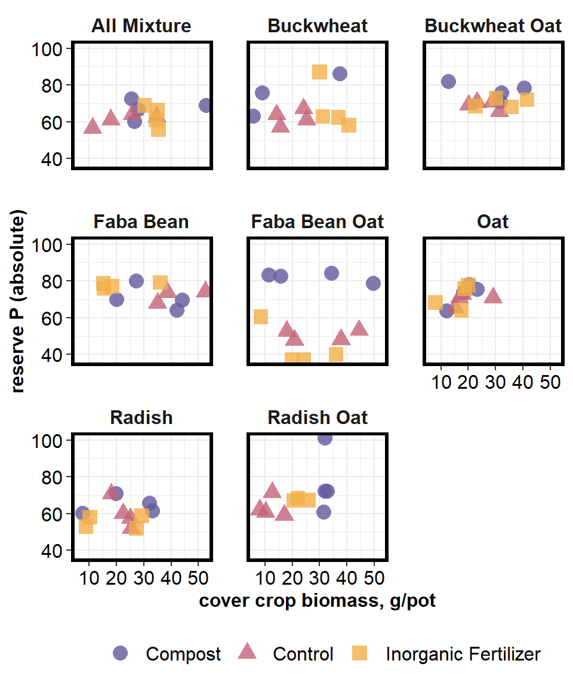
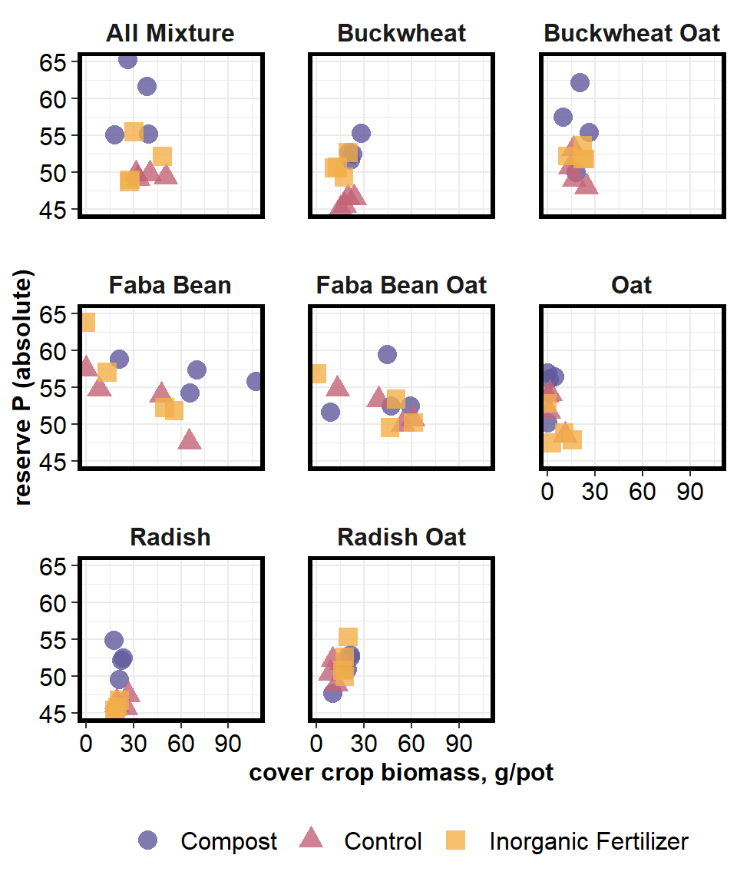

Untitled
================
Erin C Rooney
5/26/2021

## R Markdown

### Phosphorus Availability

#### Cover Crops and Compost

#### May 26 2021

## RELABUND PLOTS

<!-- -->

<!-- -->

## PHOSPHORUS (ABSOLUTE) PLOTS

#### Available P

<!-- -->

#### Reserve P

<!-- -->

#### Organic P

<!-- -->

#### Unavailable P

<!-- -->

#### Available P separated by Time 1 and 2 (greenhouse rotations)

#### TIME 1

<!-- -->

#### TIME 2

<!-- -->

#### Reserve P separated by Time 1 and 2 (greenhouse rotations)

#### TIME 1

<!-- -->

#### TIME 2

<!-- -->
