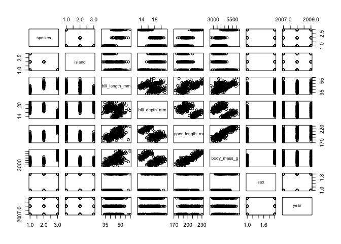

Untitled
================
Kaizad F. Patel
5/26/2021

This is regular text

``` r
library(tidyverse)
```

    ## ── Attaching packages ─────────────────────────────────────── tidyverse 1.3.0 ──

    ## ✓ ggplot2 3.3.3     ✓ purrr   0.3.4
    ## ✓ tibble  3.0.6     ✓ dplyr   1.0.4
    ## ✓ tidyr   1.1.2     ✓ stringr 1.4.0
    ## ✓ readr   1.4.0     ✓ forcats 0.5.1

    ## ── Conflicts ────────────────────────────────────────── tidyverse_conflicts() ──
    ## x dplyr::filter() masks stats::filter()
    ## x dplyr::lag()    masks stats::lag()

``` r
library(palmerpenguins)
```

Dealing with R:

1.  in-text R usage

One plus two equals `1+2`.

1.  Create an R chunk using \`\`\` you need to specify “r” as the coding
    language

``` r
names(iris)
```

    ## [1] "Sepal.Length" "Sepal.Width"  "Petal.Length" "Petal.Width"  "Species"

Hide the code using `echo = FALSE`

    ## [1] "Sepal.Length" "Sepal.Width"  "Petal.Length" "Petal.Width"  "Species"

Hide the output

To skip the chunk altogether (i.e. skip the evaluation), use
`eval = FALSE`

``` r
plot(penguins)
```

<!-- -->

------------------------------------------------------------------------

Headers

# H1

## H2

### H3

#### H4

##### H5

###### H6

regular text

------------------------------------------------------------------------

In-text formatting. **bold**, *italics*, ~~strikethrough~~,
<sub>subscript</sub>, <sup>superscript</sup>

Fe<sup>+3</sup>

------------------------------------------------------------------------

tables

1.  creating tables manually in markdown

| colA | colB |
|------|------|
| 1    | 2    |
| 1    | 2    |

1.  create tables using knitr::kable()

``` r
a = penguins %>% 
  head() %>%  knitr::kable()
```

object = summary\_table()

in markdown

loadd(object) readd(object) %&gt;% change1 %&gt;% change2 %&gt;%
knitr::kable()

------------------------------------------------------------------------

------------------------------------------------------------------------

<details>
<summary>
Click to open
</summary>

this is the text.

this is more text.

this is the text.  
this is more text.
</details>
